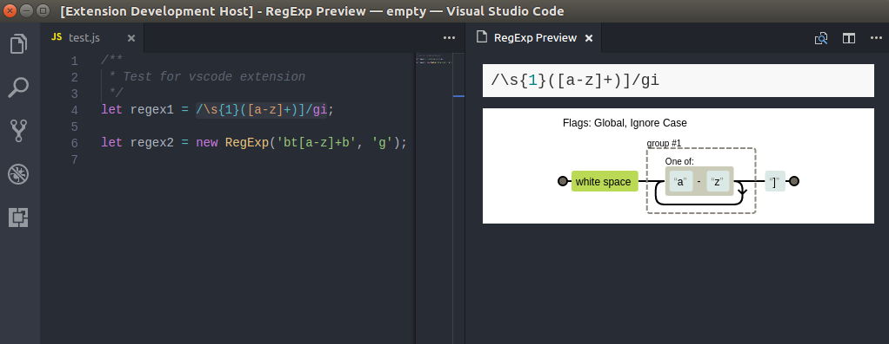
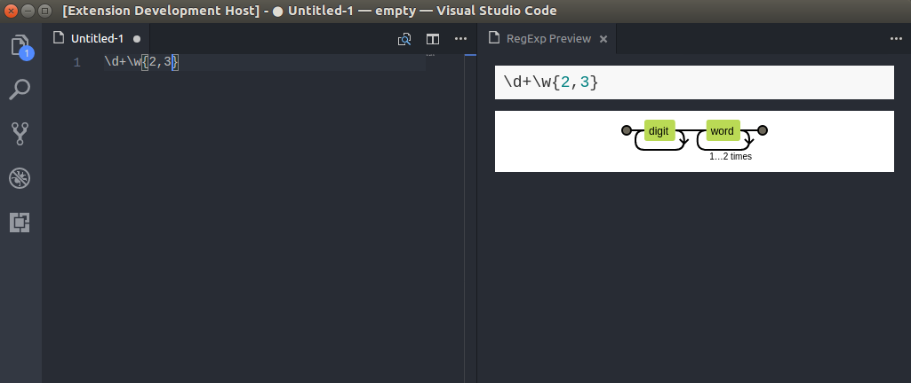

# RegExp Preview

  

VSCode extension based on [regexper-static](https://github.com/javallone/regexper-static). Including regexp expression preivewer and realtime preivew editor.

## Preview

## Editor

## Installing

This extension is available for free in the [Visual Studio Code Marketplace](https://marketplace.visualstudio.com/items/akamud.vscode-theme-onedark)

## What's new?

Click here to go to the [Changelog](https://github.com/akamud/vscode-theme-onedark/blob/master/CHANGELOG.md)
